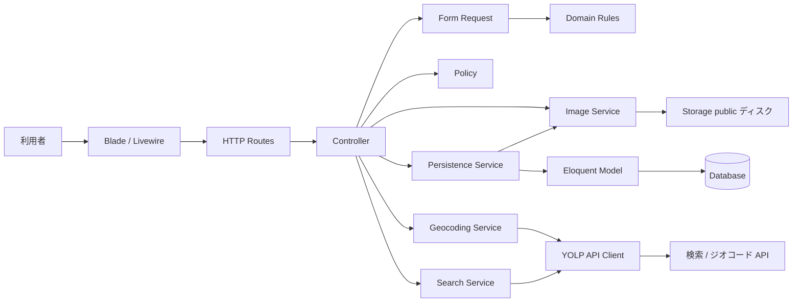
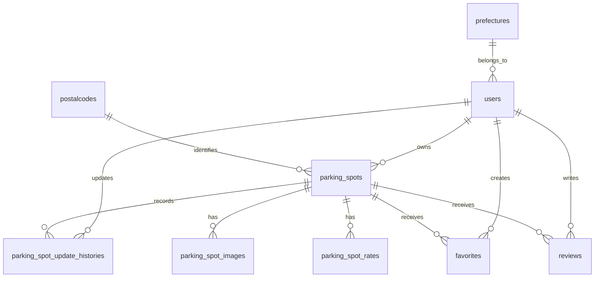

# Bike Parking 簡易設計書

## 1. 文書情報

| 項目 | 内容 |
| --- | --- |
| 対象 | Bike Parking Web アプリケーション |
| 作成日 | 2026-07-13 |
| 対象コード | Laravel アプリケーションの現行実装 |
| 関連図 | [状態遷移図](state-transition.md) |

本書は現行コードから読み取れる構成と処理をまとめた簡易設計書である。将来仕様ではなく、実装済み範囲を基準とする。

## 2. システム概要

利用者がログイン後、駐輪場情報を登録・編集し、トップ画面や検索画面から駐輪場を参照する Web アプリケーションである。住所検索・緯度経度取得には郵便番号マスタと外部ジオコード API を利用する。

主な技術要素は次のとおり。

- Laravel のルーティング、Controller、Form Request、Eloquent Model
- Blade による画面表示
- Livewire による住所補完と地図表示範囲検索
- Vite / Tailwind CSS によるフロントエンド
- DB は Laravel のマイグレーションで管理
- 駐輪場画像は WebP に変換し、public ディスクへ保存

## 3. レイヤ構成



### 主な責務

| 層 | 主な責務 | 主なファイル |
| --- | --- | --- |
| Route | URL と処理の対応付け、認証 middleware | `routes/web.php`, `routes/auth.php` |
| Controller | 入力受付、Policy による認可、画面遷移、セッション上の確認データ管理 | `app/Http/Controllers/` |
| Policy | 駐輪場の共同編集とレビューの本人更新に関する認可 | `app/Policies/` |
| Form Request | 駐輪場・料金帯・レビューの入力検証、ドメインエラーの入力項目への変換 | `app/Http/Requests/` |
| Domain Rules | 料金帯の曜日区分・時間範囲・重複判定、駐車可能な排気量区分の順序と表示名 | `app/Domain/` |
| Persistence Service | 駐輪場・料金・更新履歴のトランザクション制御 | `app/Services/ParkingSpotPersistenceService.php` |
| Geocoding Service | 駐輪場登録用の住所ジオコード | `app/Services/ParkingSpotGeocodingService.php` |
| Search Service | 検索位置と検索結果なしの場合の表示位置を決定 | `app/Services/SearchService.php` |
| YOLP API Client | 検索・ジオコードAPIの設定、通信、リトライ、レスポンス正規化 | `app/Services/YolpApiClient.php` |
| Image Service | 確認用画像変換、確定保存、画像レコード同期、補償削除 | `app/Services/ParkingSpotImageService.php` |
| Model | DB とリレーション、表示用アクセサ | `app/Models/` |
| View / Livewire | 入力フォーム、確認・詳細・一覧、地図連携 | `resources/views/`, `app/Livewire/` |

## 4. 主要画面・ルート

| 機能 | HTTP | ルート | 認証 |
| --- | --- | --- | --- |
| トップ | GET | `/` | 不要 |
| 検索 | GET | `/search` | 不要 |
| 駐輪場詳細 | GET | `/parking-spots/{parkingSpot}` | 不要 |
| レビュー投稿・更新 | POST | `/parking-spot/{parkingSpot}/reviews` | 必須 |
| お気に入り一覧 | GET | `/favorites` | 必須 |
| お気に入り追加 | POST | `/parking-spot/{parkingSpot}/favorite` | 必須 |
| お気に入り解除 | DELETE | `/parking-spot/{parkingSpot}/favorite` | 必須 |
| 駐輪場登録画面 | GET | `/parking-spots/create` | 必須 |
| 駐輪場確認 | POST | `/parking-spots/confirm` | 必須 |
| 駐輪場登録確定 | POST | `/parking-spots` | 必須 |
| 駐輪場編集画面 | GET | `/parking-spots/{parkingSpot}/edit` | 必須 |
| 駐輪場更新確定 | PUT/PATCH | `/parking-spots/{parkingSpot}` | 必須 |
| プロフィール | GET/PATCH/DELETE | `/profile` | 必須 |
| 認証 | GET/POST | `/login`, `/register`, `/logout` | 機能ごとに異なる |

## 5. 駐輪場登録・更新処理

### 登録

1. 登録画面で基本情報、営業時間、料金帯、任意画像（最大4枚）を入力する。
2. 郵便番号から住所を補完し、`ParkingSpotRequest` で入力を検証する。
3. 住所を外部 API でジオコードし、緯度・経度と正規化済み住所を確定する。
4. サーバー側の確認セッションへ登録モード、入力値、所有する一時画像を保存し、確認画面を表示する。
5. 確定時に `ParkingSpotPersistenceService::create()` が駐輪場本体、画像情報、料金帯を1つのDBトランザクションで保存する。画像の確定保存と補償削除は `ParkingSpotImageService` へ委譲する。

### 更新

登録と同じ確認フローを通り、確定時に `ParkingSpotPersistenceService::update()` が対象行をロックし、本体、画像情報、料金帯、更新履歴を1つのDBトランザクションで更新する。編集画面を開いた時点で対象IDをサーバー側の確認セッションへ固定し、確認POSTのIDが一致しない場合は更新へ進めない。料金帯はトランザクション内で既存行を削除して入力内容を再作成する。画像は削除対象に選択された既存画像だけを除き、残した既存画像の順序を維持したまま新しい画像を末尾へ追加する。更新時は変更された本体項目、画像、料金帯の before / after、更新ユーザー、更新日時を `parking_spot_update_histories` に記録する。

編集画面の表示、編集内容の確認、更新確定では、いずれも `ParkingSpotPolicy::update()` を通して認可する。共同編集を前提とするため、駐輪場の登録者かどうかにかかわらずログイン済みユーザーは更新でき、未ログインユーザーは認証 middleware によりログイン画面へ遷移する。

### 画像

1件の駐輪場へ最大4枚を登録でき、編集時も保持する既存画像と追加画像の合計を4枚以内に制限する。ファイル選択時は保存済み画像と先に選択した画像を残したまま、新しく選択した画像をブラウザー上の末尾へ即時プレビューする。選択によって合計が5枚以上になる場合はその選択分を追加・プレビューせず、上限エラーを表示する。各画像の削除ボタンを押すとプレビューと送信対象から即時に除外する。既存画像の実ファイルは更新が成功するまで保持する。アップロード画像は確認時に WebP 化して推測困難な名前で `temp/parking-spots/` に仮保存し、そのブラウザーセッションが作成したパスだけを再送信時に受け付ける。登録・更新確定時に `parking-spots/` へコピーし、DBコミット後に仮画像と削除対象の旧画像を削除するため、DB更新や画像コピーに失敗した場合も旧画像と仮画像を保護して再試行できる。途中でコピー済みとなった新画像は補償削除し、削除だけに失敗したファイルはDBから参照されない孤立ファイルとして残すことで表示中データの欠損を防ぐ。画像の順序は `parking_spot_images.position` で保持し、先頭画像を一覧・ホームの代表画像として従来の `parking_spots.image_path` にも保持する。既存の単一画像データはマイグレーション時に画像テーブルへ移行し、画像未設定の場合は `public/images/noimage.jpg` を表示する。変換後サイズの上限は1枚あたり5MB。

Controller は `ParkingSpotPersistenceService`、`ParkingSpotGeocodingService`、`ParkingSpotImageService` をコンテナからコンストラクタ注入する。画像の確定保存結果は `PersistedParkingSpotImages` として返し、DB失敗時に削除する新規画像と、コミット後に削除する一時画像を永続化処理へ明示的に受け渡す。

登録・編集は共通の `parking_spot_confirmation` セッションを使用する。戻る操作や保存エラーでは確認状態を保持し、保存成功後だけ破棄する。確定ルートは同一セッションからの同時送信を直列化し、セッション欠落・期限切れ・二重送信時はDB更新を行わず入力画面またはホームへ案内する。離脱やセッション期限切れで残った仮画像は、1時間ごとに実行する `parking-spots:prune-temporary-images` が24時間経過後に削除する。

登録・編集画面の入力HTMLは共通の `parking-spot-form` Bladeコンポーネントを使用する。確認画面から戻った入力やバリデーション失敗時のフラッシュ入力を最優先し、フラッシュ入力がない場合は新規登録の初期値または編集対象の既存値を表示する。画面モード、編集対象ID、確認送信先はコンポーネントの引数として渡す。

## 6. データ設計



| テーブル | 役割 | 主な項目 |
| --- | --- | --- |
| `users` | 利用者 | 認証情報、氏名、都道府県 |
| `parking_spots` | 駐輪場本体 | 所有者、名称、`postalcode_id`、住所、緯度経度、営業時間、収容台数、駐車可能な最大排気量区分、代表画像 |
| `parking_spot_images` | 駐輪場画像 | 対象駐輪場、保存パス、表示順 |
| `parking_spot_rates` | 料金帯 | 曜日区分、時間帯、単位、料金、無料時間、最大料金 |
| `parking_spot_update_histories` | 更新履歴 | 対象駐輪場、更新ユーザー、変更内容（JSON）、更新日時 |
| `favorites` | お気に入り関連 | 利用者、駐輪場（利用者と駐輪場の組み合わせは一意） |
| `reviews` | レビュー関連 | 利用者、駐輪場、1〜5の評価、コメント（利用者と駐輪場の組み合わせは一意） |
| `prefectures` / `cities` / `postalcodes` | 住所マスタ | 日本郵便のUTF-8版データから月次同期する郵便番号と住所の対応。廃止郵便番号は参照保持のため無効化。開発用の全国駐輪場サンプルは郵便番号・緯度経度CSVから必要分だけ作成 |

### 料金の表示ルール

- 通常料金は「単位 料金円」で表示する。
- 無料時間がある場合は「最初の無料 / 以降料金」と表示する。
- 最大料金が `NULL` の場合は「最大料金なし」と表示する。
- `00:00〜00:00` は「00:00 ～ 24:00」、終了時刻が開始時刻より前なら終了時刻に「翌」を付ける。
- ホーム、地図検索、お気に入りの一覧では、登録順の先頭を代表料金として区分・時間帯とともに表示する。
- 料金帯が複数ある場合は代表料金に加えて「ほかN件の料金帯」、未登録の場合は「料金未登録」と表示する。
- 一覧用の料金取得は `ParkingSpot::representativeRate()` と `withRateSummary()` に集約し、料金順ソートや時間帯フィルタを追加するときの起点とする。

## 7. 入力・整合性ルール

- 認証識別子には一意なユーザーIDを使用し、メールアドレスは保持しない。
- パスワードはログイン後のプロフィール画面から変更できる。メール確認とメール経由のパスワード再設定は提供しない。
- 駐輪場名、住所、営業時間、料金は必須。
- 収容台数は 1 以上。
- 新規登録・編集では駐車可能な最大排気量区分を必須とする。既存の未設定データは表示可能とし、排気量指定検索からは除外する。
- 駐輪場画像は0〜4枚、jpg / jpeg / png / webp、1枚あたりアップロード時20MB以下とする。
- 料金帯は 1〜4 件。
- 料金は 0 円以上、最大料金は設定する場合 1 円以上。
- 最大料金なしを選択した場合、最大料金は `NULL` として保存する。
- 無料時間なしの場合、無料時間は 0 分として保存する。
- 適用曜日が重なる料金帯では、重複する時間帯を登録不可とする。終日は24時間、日付またぎは日末と日始めに分割し、隣接するだけの時間帯は重複としない。この判定は `app/Domain/ParkingSpotRates/` に集約する。
- レビューの評価は 1〜5、コメントは必須かつ1,000文字以内とする。
- レビューは1ユーザーにつき1駐輪場1件とし、再投稿時は本人の既存レビューを更新する。
- お気に入りは1ユーザーにつき1駐輪場1件とし、追加・解除はログインユーザー自身の関連だけを操作する。

## 8. 現状の制約

- お気に入りは駐輪場詳細・トップ・地図検索一覧から追加・解除できる。登録件数は各駐輪場とナビゲーションに表示し、利用者ごとの一覧画面を提供する。
- レビューは駐輪場詳細から投稿・更新でき、平均評価と件数をトップ・検索一覧・詳細に表示する。投稿にはログインが必要で、既存レビューを更新できるのは投稿者本人のみとする。
- 駐輪場は共同編集方式であり、`ParkingSpotPolicy` がログイン済みユーザー全員の編集を許可する。履歴は駐輪場詳細画面に新しい順で最大10件表示し、全件は `ParkingSpot::updateHistories()` から参照できる。
- トップ画面は新着 3 件、地図表示の範囲検索は最大 50 件に制限される。
- 地図検索で排気量を指定した場合、指定区分以上に対応する駐輪場だけを一覧とマーカーへ表示する。指定なしの場合は排気量未設定の既存データも含め、検索条件はGETクエリへ保持する。
- 検索・詳細・登録確認画面の地図は共通の `x-leaflet-map` を利用する。中心座標、ズーム、マーカー、Livewireへの表示範囲通知はコンポーネントの設定として渡し、Leafletの初期化とマーカー更新は `resources/js/leaflet-map.js` が担当する。初期化に失敗した場合は地図領域にエラーを表示し、`leaflet-map:error` イベントを発火する。
- 外部YOLP APIの設定（`YOLP_URL` / `YOLP_GEOCODE_URL` / `YOLP_CLIENT_ID`）は `config/services.php` を経由し、検索と登録で共通クライアントを利用する。

## 9. テスト方針

登録・編集フォームの共通表示と入力復元は `tests/Feature/ParkingSpotFormTest.php`、料金表示・入力・保存・日付またぎ・最大料金なしの主要ケースは `tests/Feature/ParkingSpotRateDisplayTest.php`、料金帯の曜日・時間範囲・重複判定の境界値は `tests/Unit/Domain/ParkingSpotRates/`、複数画像の主要フローは `tests/Feature/ParkingSpotImageTest.php`、確認セッションと一時画像清掃は `tests/Feature/ParkingSpotConfirmationSessionTest.php` に集約されている。保存更新・YOLP API・ジオコード・画像サービスの境界は `tests/Feature/ParkingSpotPersistenceServiceTest.php` と `tests/Unit/Services/` で確認する。変更時はまず次の focused test を実行し、必要に応じて全体テストを実行する。

```bash
vendor/bin/sail test tests/Feature/ParkingSpotFormTest.php
vendor/bin/sail test tests/Unit/Domain/ParkingSpotRates
vendor/bin/sail test tests/Feature/ParkingSpotRateDisplayTest.php
vendor/bin/sail test tests/Feature/ParkingSpotImageTest.php
vendor/bin/sail test tests/Feature/ParkingSpotConfirmationSessionTest.php
vendor/bin/sail test tests/Feature/ParkingSpotAuthorizationHistoryTest.php
vendor/bin/sail test tests/Feature/ParkingSpotReviewTest.php
vendor/bin/sail test tests/Feature/ParkingSpotFavoriteTest.php
vendor/bin/sail test
```
