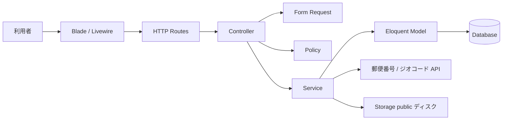
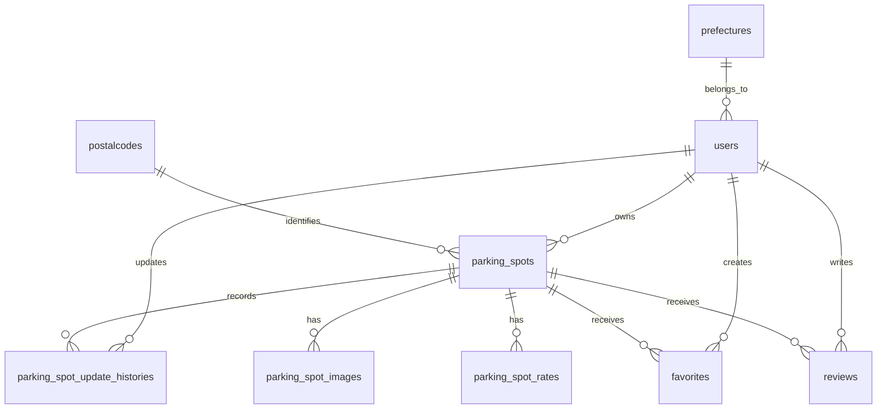

# Bike Parking 簡易設計書

## 1. 文書情報

| 項目 | 内容 |
| --- | --- |
| 対象 | Bike Parking Web アプリケーション |
| 作成日 | 2026-07-13 |
| 対象コード | Laravel アプリケーションの現行実装 |
| 関連図 | [状態遷移図](state-transition.md) |

本書は現行コードから読み取れる構成と処理をまとめた簡易設計書である。将来仕様ではなく、実装済み範囲を基準とする。

## 2. システム概要

利用者がログイン後、駐輪場情報を登録・編集し、トップ画面や検索画面から駐輪場を参照する Web アプリケーションである。住所検索・緯度経度取得には郵便番号マスタと外部ジオコード API を利用する。

主な技術要素は次のとおり。

- Laravel のルーティング、Controller、Form Request、Eloquent Model
- Blade による画面表示
- Livewire による住所補完と地図表示範囲検索
- Vite / Tailwind CSS によるフロントエンド
- DB は Laravel のマイグレーションで管理
- 駐輪場画像は WebP に変換し、public ディスクへ保存

## 3. レイヤ構成



### 主な責務

| 層 | 主な責務 | 主なファイル |
| --- | --- | --- |
| Route | URL と処理の対応付け、認証 middleware | `routes/web.php`, `routes/auth.php` |
| Controller | 入力受付、Policy による認可、画面遷移、セッション上の確認データ管理 | `app/Http/Controllers/` |
| Policy | 駐輪場の共同編集とレビューの本人更新に関する認可 | `app/Policies/` |
| Form Request | 駐輪場・料金帯・レビューの入力検証、料金帯重複検証 | `app/Http/Requests/` |
| Service | 駐輪場・料金の保存更新、住所のジオコード、画像変換 | `app/Services/ParkingSpotService.php` |
| Model | DB とリレーション、表示用アクセサ | `app/Models/` |
| View / Livewire | 入力フォーム、確認・詳細・一覧、地図連携 | `resources/views/`, `app/Livewire/` |

## 4. 主要画面・ルート

| 機能 | HTTP | ルート | 認証 |
| --- | --- | --- | --- |
| トップ | GET | `/` | 不要 |
| 検索 | GET | `/search` | 不要 |
| ダッシュボード | GET | `/dashboard` | 必須 |
| 駐輪場詳細 | GET | `/parking-spot/detail/{id}` | 必須 |
| レビュー投稿・更新 | POST | `/parking-spot/{parkingSpot}/reviews` | 必須 |
| お気に入り一覧 | GET | `/favorites` | 必須 |
| お気に入り追加 | POST | `/parking-spot/{parkingSpot}/favorite` | 必須 |
| お気に入り解除 | DELETE | `/parking-spot/{parkingSpot}/favorite` | 必須 |
| 駐輪場登録画面 | GET | `/parking-spot/create` | 必須 |
| 駐輪場確認 | POST | `/parking-spot/confirm` | 必須 |
| 駐輪場登録確定 | POST | `/parking-spot/store` | 必須 |
| 駐輪場編集画面 | GET | `/parking-spot/edit/{id}` | 必須 |
| 駐輪場更新確定 | POST | `/parking-spot/update` | 必須 |
| プロフィール | GET/PATCH/DELETE | `/profile` | 必須 |
| 認証 | GET/POST | `/login`, `/register`, `/logout` | 機能ごとに異なる |

## 5. 駐輪場登録・更新処理

### 登録

1. 登録画面で基本情報、営業時間、料金帯、任意画像（最大4枚）を入力する。
2. 郵便番号から住所を補完し、`ParkingSpotRequest` で入力を検証する。
3. 住所を外部 API でジオコードし、緯度・経度と正規化済み住所を確定する。
4. 確認用データをセッションへ保存し、確認画面を表示する。
5. 確定時に `ParkingSpotService::saveParkingSpot()` が駐輪場本体、画像情報、料金帯を1つのDBトランザクションで保存する。

### 更新

登録と同じ確認フローを通り、確定時に `updateParkingSpot()` が対象行をロックし、本体、画像情報、料金帯、更新履歴を1つのDBトランザクションで更新する。料金帯はトランザクション内で既存行を削除して入力内容を再作成し、新しい画像が選択された場合は既存画像を選択された画像一式へ置き換える。更新時は変更された本体項目、画像、料金帯の before / after、更新ユーザー、更新日時を `parking_spot_update_histories` に記録する。

編集画面の表示、編集内容の確認、更新確定では、いずれも `ParkingSpotPolicy::update()` を通して認可する。共同編集を前提とするため、駐輪場の登録者かどうかにかかわらずログイン済みユーザーは更新でき、未ログインユーザーは認証 middleware によりログイン画面へ遷移する。

### 画像

1件の駐輪場へ最大4枚を登録できる。アップロード画像は確認時に WebP 化して `temp/parking-spots/` に仮保存し、登録・更新確定時に `parking-spots/` へコピーする。DBコミット後に仮画像と置換前の旧画像を削除するため、DB更新や画像コピーに失敗した場合も旧画像と仮画像を保護して再試行できる。途中でコピー済みとなった新画像は補償削除し、削除だけに失敗したファイルはDBから参照されない孤立ファイルとして残すことで表示中データの欠損を防ぐ。画像の順序は `parking_spot_images.position` で保持し、先頭画像を一覧・ホームの代表画像として従来の `parking_spots.image_path` にも保持する。既存の単一画像データはマイグレーション時に画像テーブルへ移行し、画像未設定の場合は `public/images/noimage.jpg` を表示する。変換後サイズの上限は1枚あたり5MB。

## 6. データ設計



| テーブル | 役割 | 主な項目 |
| --- | --- | --- |
| `users` | 利用者 | 認証情報、氏名、都道府県 |
| `parking_spots` | 駐輪場本体 | 所有者、名称、住所、緯度経度、営業時間、収容台数、代表画像 |
| `parking_spot_images` | 駐輪場画像 | 対象駐輪場、保存パス、表示順 |
| `parking_spot_rates` | 料金帯 | 曜日区分、時間帯、単位、料金、無料時間、最大料金 |
| `parking_spot_update_histories` | 更新履歴 | 対象駐輪場、更新ユーザー、変更内容（JSON）、更新日時 |
| `favorites` | お気に入り関連 | 利用者、駐輪場（利用者と駐輪場の組み合わせは一意） |
| `reviews` | レビュー関連 | 利用者、駐輪場、1〜5の評価、コメント（利用者と駐輪場の組み合わせは一意） |
| `prefectures` / `cities` / `postalcodes` | 住所マスタ | 郵便番号と住所の対応 |

### 料金の表示ルール

- 通常料金は「単位 料金円」で表示する。
- 無料時間がある場合は「最初の無料 / 以降料金」と表示する。
- 最大料金が `NULL` の場合は「最大料金なし」と表示する。
- `00:00〜00:00` は「00:00 ～ 24:00」、終了時刻が開始時刻より前なら終了時刻に「翌」を付ける。
- ホーム、地図検索、お気に入りの一覧では、登録順の先頭を代表料金として区分・時間帯とともに表示する。
- 料金帯が複数ある場合は代表料金に加えて「ほかN件の料金帯」、未登録の場合は「料金未登録」と表示する。
- 一覧用の料金取得は `ParkingSpot::representativeRate()` と `withRateSummary()` に集約し、料金順ソートや時間帯フィルタを追加するときの起点とする。

## 7. 入力・整合性ルール

- 認証識別子には一意なユーザーIDを使用し、メールアドレスは保持しない。
- パスワードはログイン後のプロフィール画面から変更できる。メール確認とメール経由のパスワード再設定は提供しない。
- 駐輪場名、住所、営業時間、料金は必須。
- 収容台数は 1 以上。
- 駐輪場画像は0〜4枚、jpg / jpeg / png / webp、1枚あたりアップロード時20MB以下とする。
- 料金帯は 1〜4 件。
- 料金は 0 円以上、最大料金は設定する場合 1 円以上。
- 最大料金なしを選択した場合、最大料金は `NULL` として保存する。
- 無料時間なしの場合、無料時間は 0 分として保存する。
- 同じ曜日区分の重複する時間帯は登録不可。日付またぎの時間帯も分割して重複判定する。
- レビューの評価は 1〜5、コメントは必須かつ1,000文字以内とする。
- レビューは1ユーザーにつき1駐輪場1件とし、再投稿時は本人の既存レビューを更新する。
- お気に入りは1ユーザーにつき1駐輪場1件とし、追加・解除はログインユーザー自身の関連だけを操作する。

## 8. 現状の制約

- お気に入りは駐輪場詳細・トップ・地図検索一覧から追加・解除できる。登録件数は各駐輪場とナビゲーションに表示し、利用者ごとの一覧画面を提供する。
- レビューは駐輪場詳細から投稿・更新でき、平均評価と件数をトップ・検索一覧・詳細に表示する。投稿にはログインが必要で、既存レビューを更新できるのは投稿者本人のみとする。
- 駐輪場は共同編集方式であり、`ParkingSpotPolicy` がログイン済みユーザー全員の編集を許可する。履歴は駐輪場詳細画面に新しい順で最大10件表示し、全件は `ParkingSpot::updateHistories()` から参照できる。
- トップ画面は新着 3 件、地図表示の範囲検索は最大 50 件に制限される。
- 外部ジオコード API の設定（`YOLP_GEOCODE_URL` / `YOLP_CLIENT_ID`）が必要である。

## 9. テスト方針

料金表示・入力・保存・日付またぎ・最大料金なしの主要ケースは `tests/Feature/ParkingSpotRateDisplayTest.php`、複数画像の主要フローは `tests/Feature/ParkingSpotImageTest.php` に集約されている。変更時はまず次の focused test を実行し、必要に応じて全体テストを実行する。

```bash
vendor/bin/sail test tests/Feature/ParkingSpotRateDisplayTest.php
vendor/bin/sail test tests/Feature/ParkingSpotImageTest.php
vendor/bin/sail test tests/Feature/ParkingSpotAuthorizationHistoryTest.php
vendor/bin/sail test tests/Feature/ParkingSpotReviewTest.php
vendor/bin/sail test tests/Feature/ParkingSpotFavoriteTest.php
vendor/bin/sail test
```
