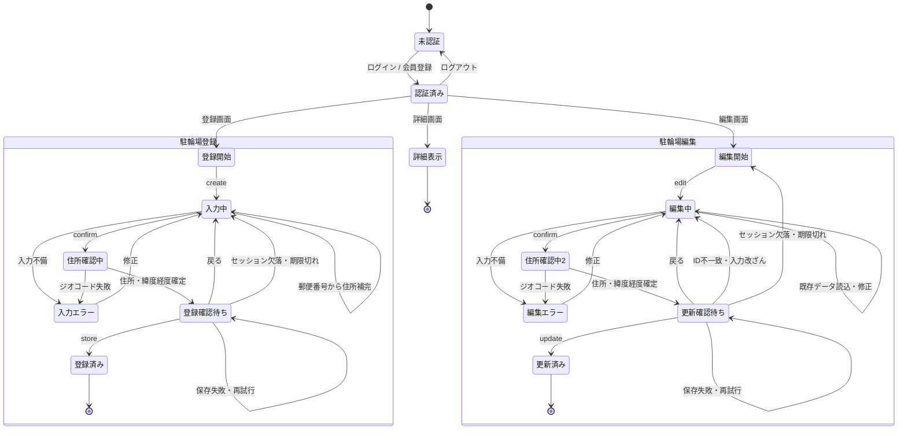
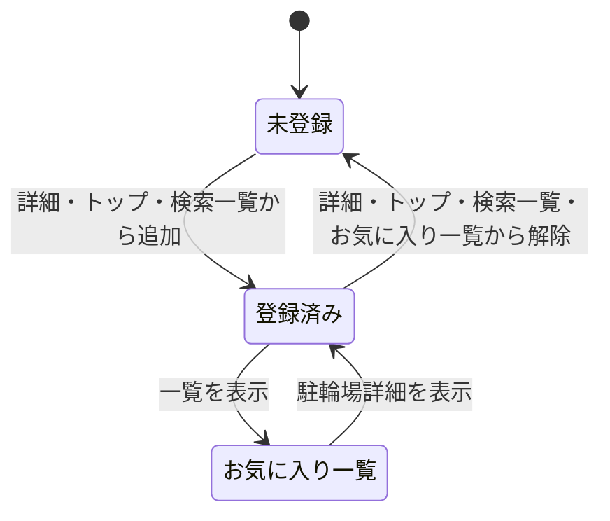
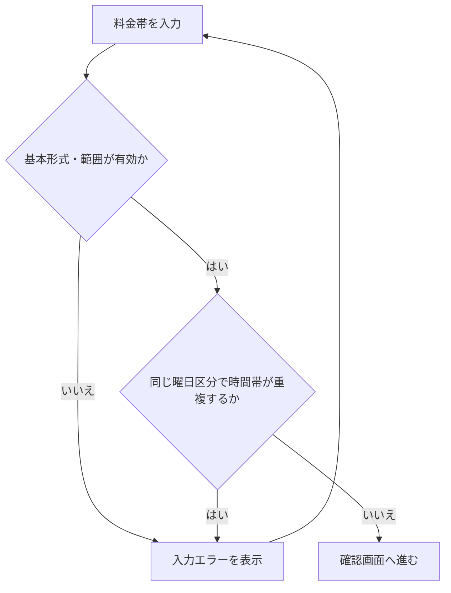

# 状態遷移図

## 対象

現行実装における、利用者の認証、駐輪場情報の登録・編集、お気に入り操作のフローを示す。図は Mermaid 形式で記述しており、GitHub や Mermaid 対応エディタで表示できる。

## 駐輪場登録・編集フロー

登録・編集の確認状態はサーバー側セッションで管理し、確定成功時だけ破棄する。確定POSTにはDB更新に必要な値を持たせず、セッション内の確認済み入力を使用する。編集対象IDと一時画像パスはセッションの信頼済みコンテキストと照合し、不一致の場合は保存しない。二重送信では最初の成功後にセッションがなくなるため、2回目は入力画面へ戻す。

## お気に入り操作フロー

お気に入りの追加・解除・一覧表示にはログインが必要で、操作対象はログインユーザー自身のお気に入りに限定される。

## 料金入力の検証サブフロー

料金帯は 1〜4 件、料金単位・曜日区分は設定値に制限される。開始時刻と終了時刻が同じ場合は終日、終了時刻が開始時刻より前の場合は日付またぎとして扱う。
